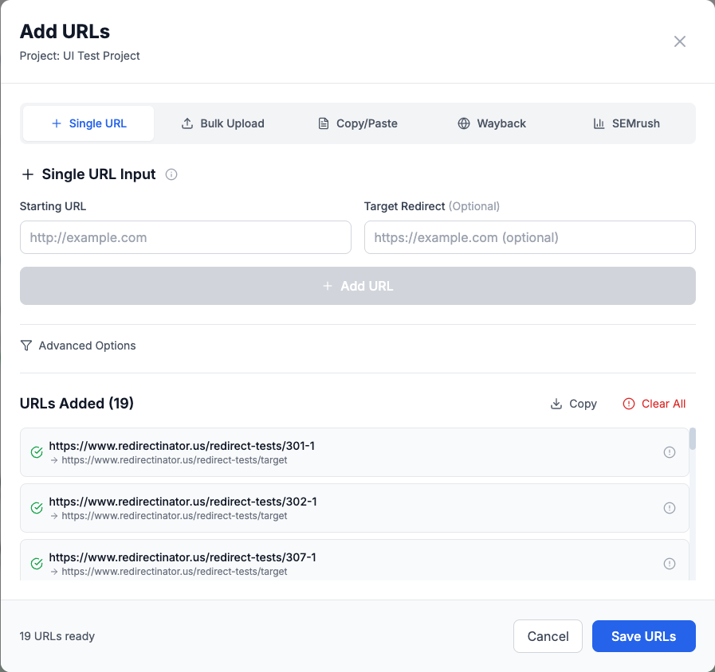
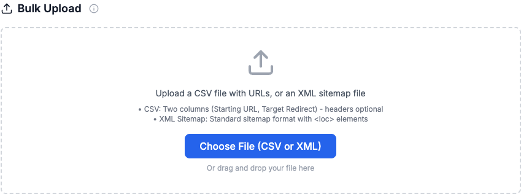
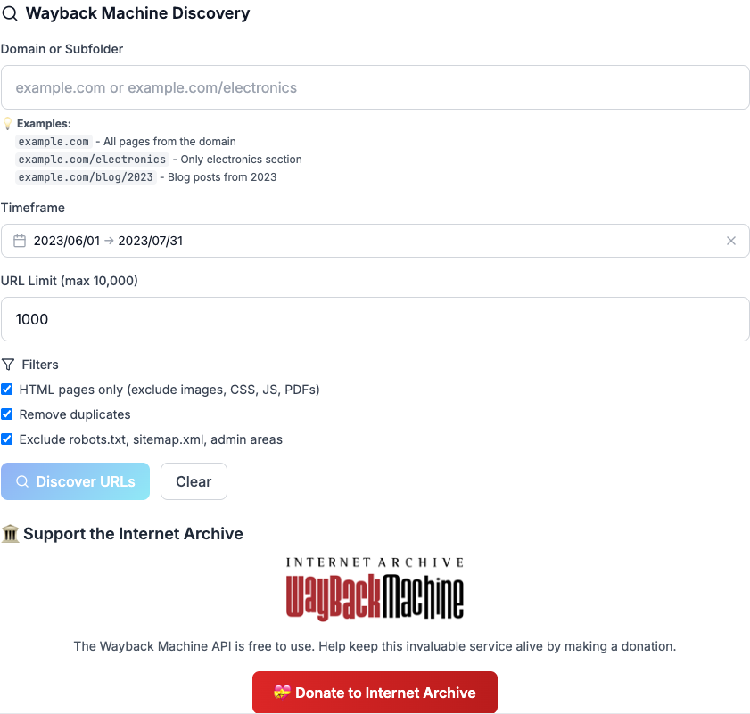

# 📚 Redirectinator - Complete User Guide

Welcome to Redirectinator, the professional URL redirect checker and monitor for SEO professionals. This comprehensive guide will walk you through all the powerful features that make Redirectinator the go-to tool for redirect analysis and site migration planning.

## 🎯 What is Redirectinator?

Redirectinator is a professional-grade tool designed to help SEO professionals, web developers, and digital marketers analyze URL redirects, plan site migrations, and ensure no valuable traffic is lost during website changes. Built with modern web technologies, it provides fast, accurate, and comprehensive redirect analysis.


## 🚀 Getting Started

### 1. Create Your First Project

When you first visit Redirectinator, you'll see the main dashboard. To get started:

1. Click **"Add Project"** to create a new project
2. Give your project a descriptive name (e.g., "Client Site Migration - Q1 2025")
3. Your project will be saved and you can return to it anytime

### 2. Understanding the Dashboard

The dashboard provides a comprehensive overview of your redirect analysis:

- **Total URLs**: Number of URLs in your project
- **Good**: URLs with proper redirects (301/302)
- **Bad**: URLs with errors or issues
- **Not Redirected**: URLs that return 200 (direct access)
- **Redirect Chain**: URLs with multiple redirects
- **Status Code Analysis**: Breakdown by HTTP status codes

## 📥 Adding URLs to Your Project

Redirectinator offers multiple ways to add URLs for analysis. Click **"Add More URLs"** to see all available options:



### Method 1: Single URL Input

Perfect for testing individual URLs or adding a few URLs manually:

1. Select **"Single URL"** tab
2. Enter the starting URL (the old URL you want to check)
3. Optionally enter a target redirect URL (where you expect it to redirect)
4. Click **"Add URL"**

**Use Cases:**
- Testing specific redirects
- Quick validation of individual URLs
- Manual entry of important URLs

### Method 2: Bulk Upload

Upload large lists of URLs from CSV files or XML sitemaps:



**Supported Formats:**
- **CSV Files**: Include "Starting URL" and optional "Target Redirect" columns
- **XML Sitemaps**: Standard sitemap format with `<loc>` elements
- **Dirty Sitemaps**: Sitemaps with extra content or formatting issues

**CSV Format Example:**
```csv
Starting URL,Target Redirect
https://oldsite.com/page1,https://newsite.com/page1
https://oldsite.com/page2,https://newsite.com/page2
https://oldsite.com/page3,
```

**Use Cases:**
- Site migrations with large URL lists
- Importing from existing redirect maps
- Processing sitemaps from old websites
- Bulk analysis of competitor redirects

### Method 3: Copy/Paste

Quickly add multiple URLs by pasting them directly:

1. Select **"Copy/Paste"** tab
2. Paste your list of URLs (one per line)
3. URLs are automatically parsed and added

**Use Cases:**
- Quick entry from spreadsheets
- Copying URLs from browser bookmarks
- Adding URLs from text files

### Method 4: Wayback Machine Discovery

Discover historical URLs from before a site migration using the Internet Archive:



**How to Use Wayback Discovery:**

1. Select **"Wayback"** tab
2. Enter the domain (e.g., `example.com` or `example.com/blog`)
3. Set the timeframe (e.g., June 2023 - July 2023)
4. Set URL limit (max 10,000)
5. Apply filters:
   - ✅ HTML pages only (exclude images, CSS, JS, PDFs)
   - ✅ Remove duplicates
   - ✅ Exclude robots.txt, sitemap.xml, admin areas
6. Click **"Discover URLs"**

**Why Use Wayback Machine Discovery:**

- **Recover Lost URLs**: Find URLs that existed before a site migration
- **Complete Migration Analysis**: Ensure no valuable pages are missed
- **Historical Content Recovery**: Discover content that was accidentally lost
- **SEO Audit Completeness**: Identify all URLs that need redirects

**Example Use Case:**
A client migrated their e-commerce site in June 2023 but didn't keep records of all their old product pages. Using Wayback Machine Discovery, you can:
1. Enter `example-store.com` as the domain
2. Set timeframe to "May 2023 - June 2023"
3. Discover 2,500+ historical product URLs
4. Process them to see which ones now return 404 errors
5. Create a comprehensive redirect plan

**Supporting the Internet Archive:**
The Wayback Machine API is completely free to use. We encourage users to support the Internet Archive through donations to help keep this invaluable service running.

### Method 5: SEMrush Top Pages Discovery

Discover top-performing pages from SEMrush data:


**How to Use SEMrush Discovery:**

1. Select **"SEMrush"** tab
2. Enter the domain to analyze
3. Set URL limit (default 1000)
4. Choose country and device type
5. Select month for historical data
6. Click **"Discover Top Pages"**

**Why Use SEMrush Discovery:**

- **Competitor Analysis**: Find top pages from competitor sites
- **Content Gap Analysis**: Identify high-performing content
- **Migration Planning**: Understand which pages drive the most traffic
- **SEO Strategy**: Focus on pages with the highest potential

**Note**: Historical Top Pages are only available on higher SEMrush plans. Lower-tier plans only support current data.

## 🔧 Redirect Detection Modes

Redirectinator offers two detection modes to handle different types of redirects:

### Default Mode (Server-Side Processing)

- **HTTP redirects only** (301, 302, 307, 308)
- **Fast processing** (100-500ms per URL)
- **No server costs** (processed on our servers)
- **Standard redirect detection**

**Best for:**
- Standard HTTP redirects
- Large batches of URLs
- Quick analysis
- Most common use cases

### Advanced Mode (Browser Extension Required)

- **Meta Refresh + JavaScript redirects**
- **Comprehensive detection** (1-3 seconds per URL)
- **Local processing** (uses your browser)
- **Full browser capabilities**

**Best for:**
- Complex redirect chains
- JavaScript-based redirects
- Meta refresh redirects
- Complete redirect analysis

## 🌐 Browser Extensions

To use Advanced Mode, you'll need to install the Redirectinator Advanced browser extension:

### Why Use the Extension?

The browser extension enables Advanced Mode, which provides:

1. **Complete Redirect Detection**: Detects all types of redirects including:
   - HTTP redirects (301, 302, 307, 308)
   - Meta refresh redirects
   - JavaScript redirects
   - Mixed redirect chains

2. **Local Processing**: All analysis happens in your browser, ensuring:
   - **Privacy**: No data sent to external servers
   - **Speed**: No server bottlenecks
   - **Reliability**: Works even when servers are down

3. **Professional Results**: Get the same comprehensive analysis that enterprise tools provide, but faster and more private.

### Installation

**Chrome Extension:**
1. Download from the Chrome Web Store (coming soon)
2. Or install manually from `/extensions` folder
3. Enable Developer mode in Chrome
4. Load the extension

**Firefox Add-on:**
1. Download from Firefox Add-ons (coming soon)
2. Or install manually from `/extensions` folder
3. Load as temporary add-on

### Extension Features

- **Automatic Detection**: The web app automatically detects when the extension is installed
- **Seamless Integration**: Switch between Default and Advanced modes instantly
- **No Configuration**: Works out of the box with sensible defaults
- **Cross-Browser Support**: Available for Chrome and Firefox

## 📊 Understanding Results

Once you've processed your URLs, you'll see detailed results in the results table:

### Result Columns

- **Status**: Visual indicator of redirect status
- **Starting URL**: The original URL you entered
- **Target Redirect**: Expected redirect destination (if specified)
- **Final URL**: Where the URL actually redirects to
- **HTTP Status**: Final HTTP status code
- **Redirect Types**: Types of redirects in the chain
- **Redirects**: Number of redirects in the chain
- **Time (ms)**: Processing time

### Status Types

- **✅ Good**: Proper redirect (301/302)
- **❌ Bad**: Error or problematic redirect
- **⚠️ Warning**: Potential issue (e.g., 302 instead of 301)
- **🔄 Loop**: Redirect loop detected
- **📄 Direct**: URL returns 200 (no redirect)

### Filtering and Search

Use the search box and filter dropdown to find specific results:
- **All Results**: Show all processed URLs
- **Redirects**: Show only URLs with redirects
- **Errors**: Show only URLs with errors
- **Loops**: Show only redirect loops
- **Direct**: Show only URLs that don't redirect

## 📤 Exporting Results

Redirectinator offers multiple export formats for your analysis:

### Export Formats

1. **CSV**: Spreadsheet format for further analysis
2. **Excel**: Microsoft Excel format with formatting
3. **JSON**: Machine-readable format for developers
4. **Report**: Formatted report for clients

### Export Contents

All exports include:
- Complete redirect chain information
- HTTP status codes
- Processing timestamps
- Error details (if any)
- Performance metrics

## 🎯 Common Use Cases

### 1. Site Migration Planning

**Scenario**: Client is migrating from `oldsite.com` to `newsite.com`

**Steps**:
1. Create project "Client Migration - Q1 2025"
2. Use Wayback Machine Discovery to find historical URLs
3. Upload current sitemap to get existing URLs
4. Process all URLs to identify:
   - URLs that need redirects (404 errors)
   - URLs with incorrect redirects
   - URLs with redirect chains that can be optimized

**Result**: Complete redirect map for the migration

### 2. SEO Audit

**Scenario**: Analyzing competitor redirects for insights

**Steps**:
1. Use SEMrush Discovery to find top pages
2. Process URLs to understand redirect strategy
3. Identify opportunities for improvement
4. Export results for client presentation

**Result**: Competitive intelligence on redirect strategies

### 3. Technical SEO Analysis

**Scenario**: Client reports traffic drops after site changes

**Steps**:
1. Use Advanced Mode with browser extension
2. Process URLs to detect JavaScript redirects
3. Identify redirect chains causing delays
4. Find broken redirects causing 404 errors

**Result**: Technical issues identified and prioritized

### 4. Content Recovery

**Scenario**: Client lost content during site migration

**Steps**:
1. Use Wayback Machine Discovery to find lost URLs
2. Process to see current status
3. Identify valuable content that needs to be restored
4. Create redirect plan for recovered content

**Result**: Lost content identified and recovery plan created

## 💡 Pro Tips

### 1. Use Wayback Machine for Complete Analysis

When doing site migration analysis, always use Wayback Machine Discovery to ensure you don't miss any valuable URLs. Even if the client has a sitemap, the Wayback Machine might have captured additional pages.

### 2. Combine Multiple Input Methods

For comprehensive analysis, combine different input methods:
- Use Wayback Machine for historical URLs
- Use SEMrush for top-performing pages
- Use bulk upload for known URL lists
- Use single URL for testing specific redirects

### 3. Use Advanced Mode for Complex Sites

If a site uses JavaScript redirects or meta refresh, you'll need Advanced Mode with the browser extension. This is especially important for:
- E-commerce sites
- Sites with complex tracking
- Sites with JavaScript-based redirects

### 4. Export Results for Client Reports

Always export your results in multiple formats:
- CSV for technical analysis
- Excel for client presentations
- Report format for executive summaries

### 5. Monitor Extension Status

Keep the browser extension updated for the best results. The web app will show you if the extension is available and working properly.

## 🔍 Troubleshooting

### Extension Not Detected

If the web app shows "Extension not detected":
1. Ensure the extension is installed and enabled
2. Refresh the web page
3. Check browser console for error messages
4. Try reinstalling the extension

### URLs Not Processing

If URLs are stuck in processing:
1. Check your internet connection
2. Try processing a smaller batch
3. Switch between Default and Advanced modes
4. Clear browser cache and cookies

### Incomplete Results

If results seem incomplete:
1. Use Advanced Mode for JavaScript redirects
2. Check if URLs are behind authentication
3. Verify URLs are accessible
4. Try processing individual URLs

## 🆘 Getting Help

### Documentation

- **This Guide**: Complete feature documentation
- **Extension Guide**: `/extensions/README.md`
- **API Documentation**: Available in the codebase

### Support

- **GitHub Issues**: Report bugs and request features
- **Email Support**: Contact through the website
- **Community**: Join discussions on GitHub

## 🎉 Conclusion

Redirectinator is a powerful tool that combines multiple data sources and detection methods to provide comprehensive redirect analysis. Whether you're planning a site migration, conducting an SEO audit, or analyzing competitor strategies, Redirectinator gives you the insights you need to make informed decisions.

The combination of Wayback Machine integration, SEMrush data, browser extensions, and multiple input methods makes Redirectinator the most comprehensive redirect analysis tool available.

**Key Benefits:**
- ✅ **Complete Coverage**: Multiple input methods ensure no URLs are missed
- ✅ **Advanced Detection**: Browser extension enables detection of all redirect types
- ✅ **Professional Results**: Enterprise-grade analysis with detailed reporting
- ✅ **Easy to Use**: Intuitive interface with helpful guidance
- ✅ **Cost Effective**: No per-URL charges or usage limits

Start your redirect analysis today and ensure your site migrations and SEO strategies are built on solid, data-driven foundations!

---

*Built with ❤️ for the SEO community by Jeff Louella*
